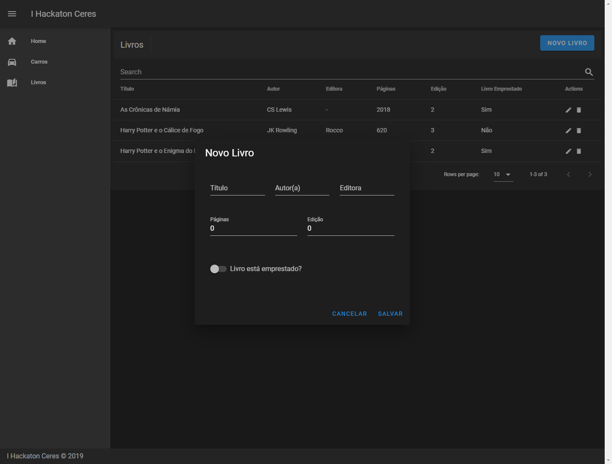
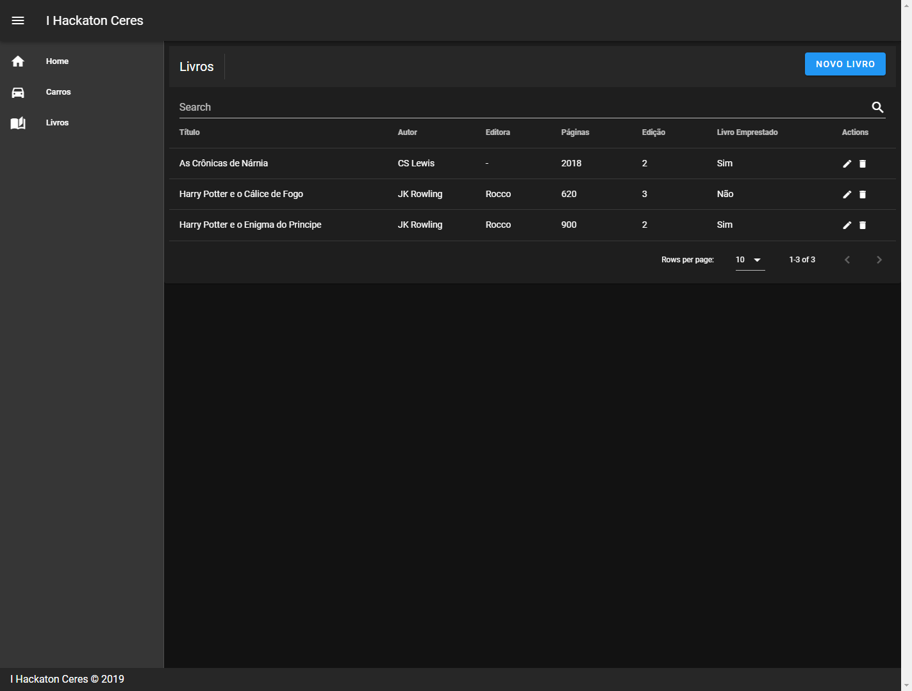

<h1 align="center">
 
I Hackaton Ceres
</h1>

This project was created to give a lecture about Vue.js in a hackaton. I created a project in Vue.js that used an api rest to show students.

  

  
  

## Features

- List books.
- Create books.
- Update books.
- Delete books.
- List cars.
- Create cars.
- Update cars.
- Delete cars.

## Getting started

- Clone project > enter the project folder
- run `yarn`
- run `yarn serve`

## License

This project is licensed under the MIT License - see the [LICENSE](https://opensource.org/licenses/MIT) page for details.

---

Created with passion by me 👨🏻‍💻
